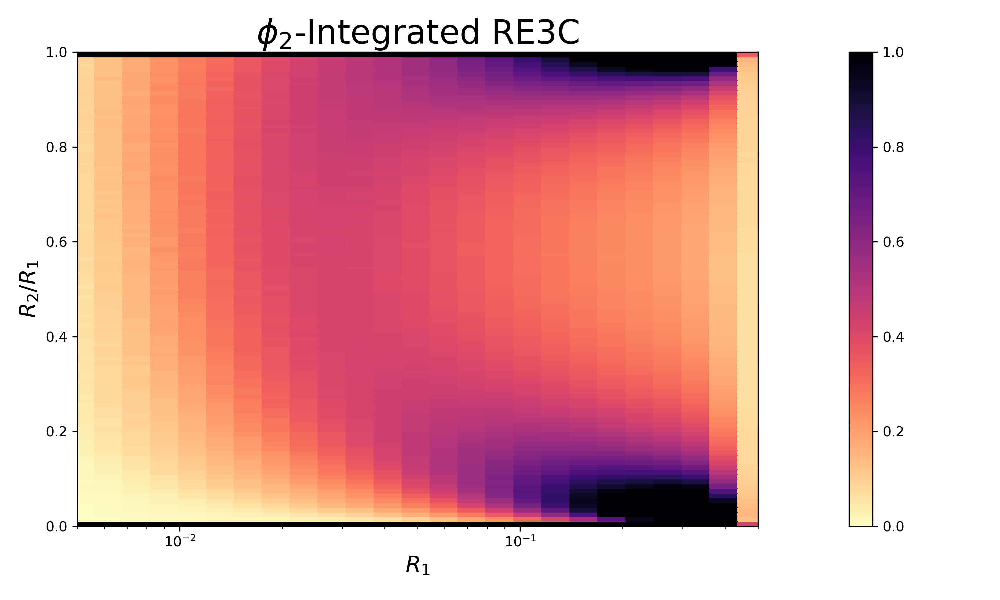

# Resolved Energy Correlator Examples

This directory contains a minimal working example to calculate energy-weighted correlations, all of which can be run by `make`. The source code is in `:/write/src/examples`.

- [Build Instructions](#build-instructions)
- [Calculating Example PENCs](#calculating-example-pencs)
- [Calculating Example RE3Cs](#calculating-example-re3cs)
<!-- - [Calculating Example EWOCs](#calculating-example-ewocs) -->


## Build Instructions

Building the code in this directory requires:
- C++ compiler (GCC or Clang)
- FastJet (version 3.0+)
- Python 3.6+ with matplotlib and numpy (for visualization)

To download the CMS Open Data dataset and compile the code used for the examples in this folder, return to the main directory and run

```bash
make
```

If you had trouble accessing the fastjet libraries (I had the error message `cannot find -lfastjettools: No such file or directory`), you may need to adjust your path manually so that `fastjet-config --libs` gives the correct fastjet path. I was able to use
```bash
export PATH=path-to-fastjet-install/bin:$PATH
```
in bash shell. In fish shell, instead use `fish_add_path --path path-to-fastjet-install/bin`.


## Calculating Example PENCs:

To run a complete example calculation of PENCs, use:

```bash
make penc_example
```

This script will:
1. Run energy correlator calculations on the CMS Open Data dataset
2. Generate histograms in the `output` directory
3. Produce visualization plots

If you have not generated any other PENC data, then the visualization this produces should look like


which resembles [Fig. 6(b) in the Supplemental Material of "New Angles on Energy Correlators" (arxiv:2410.16368)](https://arxiv.org/pdf/2410.16368#figure.6).

---

For more options in the PENC calculation:

1. Calculate PENCs:
```
./write_penc [--arguments]
```

The command line arguments are:
- `--weights`: Energy weighting parameters (the weight is $N-1$; for example, using `--weights 1` calculates the EEC with $N=2$)
- `--n_events`: Number of events to process
- `--nbins`: Number of bins in the histogram (default: 100)
- `--minbin`: Minimum bin for $R_1$ in log$_10$ scale (default: -8)
- `--maxbin`: Maximum bin for $R_1$ in log$_10$ scale (default: 1)

This outputs histogram files in a Python-readable format in the `output/` folder:
- Each file contains bin edges and centers for $R_1$
- The main histogram data is stored as a 1D array


2. Visualize Results
```
./visualize_pencs.py
```

- No arguments
- Takes all PENC histograms in the `output/` folder generated by `./write_penc` and visualizes them together in a single plot in `output/penc_examples.png`


## Calculating Example RE3Cs:

To run a complete example calculation of PENCs, use:

```bash
make re3c_examples
```

This script will:
1. Run energy correlator calculations on the CMS Open Data dataset
2. Generate histograms in the `output` directory
3. Produce visualization plots

If you have not generated any other RE3C data, then the visualization this produces should look like



which resembles [Fig. 4(a) of "New Angles on Energy Correlators" (arxiv:2410.16368)](https://arxiv.org/pdf/2410.16368#subfigure.4.1).

---

For more options in the RE3C calculation:

1. Calculate RE3Cs:
```
./write_re3c [--arguments]
```

The command line arguments are:
- `--n_events`: Number of events to process
- `--nbins`: Number of bins in the histogram (default: 100)
- `--minbin`: Minimum bin for $R_1$ in log$_10$ scale (default: -8)
- `--maxbin`: Maximum bin for $R_1$ in log$_10$ scale (default: 1)

This outputs histogram files in a Python-readable format in the `output/` folder:
- Each file contains bin edges and centers for $R_1$ and $R_2/R_1$
- The main $\phi_2$-integrated RE3C histogram data is stored as a 2D array whose first index corresponds to the $R_1$ bin, and the second to the $R_2/R_1$ ratio bin

2. Visualize Results
```
./visualize_re3c.py
```
The command line arguments are:
- No arguments
- Take all $\phi_2$-integrated RE3C histograms stored in `output/re3c_example.py` and creates/saves 2D density plots in `output/`
